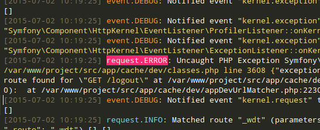

# Sublime Text Syntax : Symfony Logs
Provides a new basic syntax to Sublime Text, that highlights Symfony 2 logs

## Features
Highlights some parts of Symfony 2 logs to make them more readable on Sublime Text

## Installation (Linux)
Just put the two "SymfonyLogs.*" files in ~/.config/sublime-text-3/Packages/User/ 

## Recommanded color schemes
- Monokai
- Monokay Bright
- Cobalt
- Dawn
- Eiffel
- SpaceCadet
- Sunburst
- Twilight

## Tested versions
- Sublime Text 3

